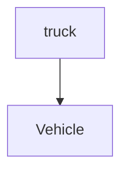
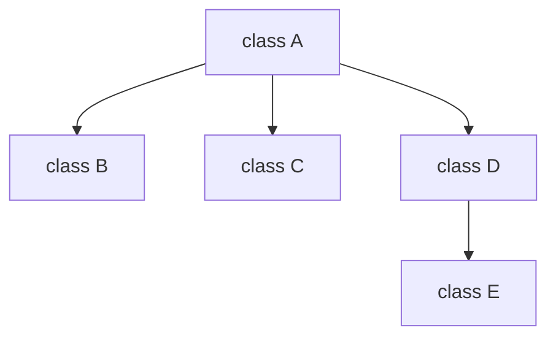

#### Lecture 10

> [!TIP]
>
> Let us think about a situation that when you are trying to design a class *vehicle*, but you want to use some code by the class *truck*.



We can see that truck is some kind of vehicle, that means that it has to own some characteristics from the vehicle class when it  need some new slot for coding to design new behavior.

##### Class Hierarchy



> [!TIP]
>
> Superclasses tend to be “more general” and subclasses “more specific”

##### Inheritance & Composition

The inheritance relationship is **is a**, while composition has a relationship as **has a**. 

##### Object & Inheritance

1. Every class directly or indirectly extends (or “inherits from”) Object.
2. Java supports only single inheritance, in which each class is derived  from exactly one direct superclass.

##### Case Study: A Payroll Application

##### Create two classes independently


The majority of those two classes are typically the same, while they only have little difference.

##### BasePlusCommissionEmployee extends Commission Employee


> [!IMPORTANT]
>
> 1. Constructor CANNOT be inherited.
>
> 2. Others depend on accessibility.
>
>    > 1. Public members in the superclass are directly accessible in the subclass
>    > 2. Package-private class members are inherited if the  subclass is in the same package as the superclass
>    > 3. A subclass does NOT inherit the private members, or, private  fields are hidden from the subclass Private fields need to be accessed using the public, protected,  or package-private methods inherited from superclass.
>
>    

#### Example of Inherit

```java
public class CommissionEmployee extends Object {
 	private String firstName;
 	private String lastName;
 	private String socialSecurityNumber;
 	private double grossSales;
 	private double commissionRate;
 	public CommissionEmployee(String first, String last, String ssn, double sales, double rate) {
 	firstName = first;
 	lastName = last;
 	socialSecurityNumber = ssn;
 	setGrossSales(sales);
	setCommissionRate(rate); 
}
public void setGrossSales(double sales) {
 	grossSales = (sales < 0.0) ? 0.0 : sales;
}
public void setCommissionRate(double rate) {
 	commissionRate = (rate > 0.0 && rate < 1.0) ? rate : 0.0;
}
```

You can eliminate *extends Object*, because it is default to the compiler.

```java
public class BasePlusCommissionEmployee extends CommissionEmployee {
 	private double baseSalary;
 	public BasePlusCommissionEmployee(String first, String last, String ssn, 
 double sales, double rate, double salary) {
 	super(first, last, ssn, sales, rate);
 	setBaseSalary(salary);
}
```

> [!IMPORTANT]
>
> *super* is a calling for the super class constructor, if it is not in the first line, you will have no argument for these variables.

##### Overwriting

```java
public double earnings() {
 	return baseSalary + ( commissionRate * grossSales );
}
public String toString() {
	return String.format("%s: %s %s\n%s: %s\n%s: %.2f\n%s: %.2f\n%s: %.2f","base-salaried", firstName, lastName,"social security number", socialSecurityNumber,"gross sales", grossSales,"commission rate", commissionRate,"base salary", baseSalary); 
}
```

This is not able to compile, because commissionRate and grossSales are private data type in the superclass, which means it can not get the information of it.

But we can use this below.

```java
public class BasePlusCommissionEmployee extends CommissionEmployee {
@Override
 	public String toString() {
	return String.format("%s: %s %s\n%s: %s\n%s: %.2f\n%s: %.2f\n%s: %.2f","base-salaried", getFirstName(), getLastName(),"social security number", getSocialSecurityNumber(),"gross sales", getGrossSales(),"commission rate", getCommissionRate(),"base salary", getBaseSalary()); 
 	}
}
public class BasePlusCommissionEmployee extends CommissionEmployee {
 @Override
public String toString() {
	return String.format("%s %s\n%s: %.2f","base-salaried", super.toString(),"base salary", getBaseSalary());
 	}
}
```

##### Method Overriding

