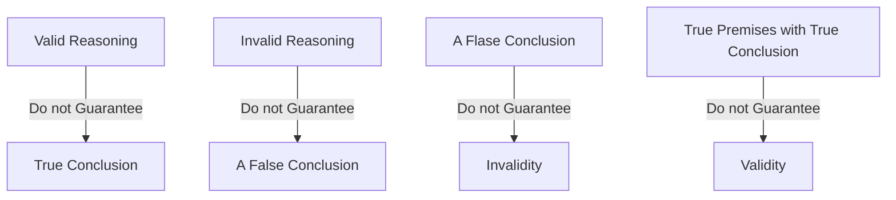

#### Lecture 1

**Relationship Between Mathematics and Logic**

|    In Math    |  In Logic  |
| :-----------: | :--------: |
|     Axiom     |  Premise   |
| Lemma/Theorem | Conclusion |
|     Proof     | Reasoning  |

**Reduction to Absurdity**

*Definition: A method of proving the falsity of a statement by assuming its truth and then derive a contradiction.*

**Syllogism**

*Construction*
$$
\begin{cases}
Major~premise\\
Minor~premise\\
Conclusion
\end{cases}
$$
**Major Premise**

*Definition: A board statement or generalization.*

**Minor Premises**

*Definition: A specific statement related to or within the scope of the major premise.*

**Conclusion**

*Definition: A statement that logically follows from the combination of the major and minor premises.*

**Things that Do not Guarantee**

**Several Rules**

1. All X is Y.

   a is X.

   Therefore, a is Y.

2. If P then Q.

   p.

   Therefore, Q.

3. If P then Q.

   Not Q.

   Therefore, not P.