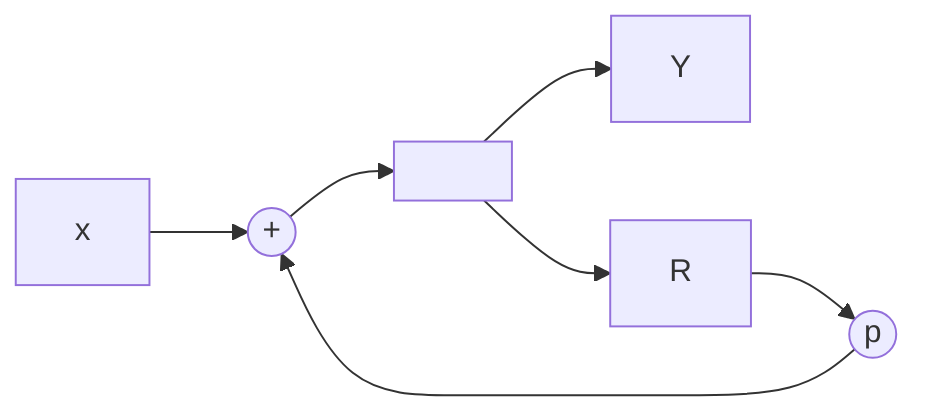

#### The Pole Of Fibonacci System

There is a question to find the poles in the Fibonacci system. To start with, we can analyze the situation that there is only one block in our system.

And here is what a single block should look like.

We can see that in this graph, $X$ is the signal input and $Y$ is the signal output, also there are loop for delay in time in between.

And here we call the $p$ as the pole in this system, we always need to find the pole, it is the center of the method to find a simplified block representation of a complex system.

And in this particular system, we can notice that the polynomial representation can be 
$$
Y= X+pRY
$$
which is in practice
$$
Y = \frac{X}{1-pR}
$$
That is everything of the single block system.

> [!NOTE]
>
> Also, you can change this kind of recursive loop to a representation of a linear system, with a lot of block paralleled, we can use the Tayler Series to find that.

Now we bring everything to a higher level.

If we have a kind of complex system, then we have to do several things, the first thing is to change it into the term of the polynomial, and separate the factors. The last thing is to find every poles of the single loops. You can figure out that as long as you can separate the polynomial with the same power, then you can translate the complex system into an equivalent series of blocks of recursive systems, just with different poles in each block. So the major problem is to find the pole for each block.

Then we can see that there is one way to quickly find the value of the pole.

Let us make an assumption that there is a complex system which can be represented as follows.
$$
Y = X+aRY+bR^2Y
$$

$$
Y(1-aR-bR^2)=X
$$

$$
Y=\frac{X}{1-aR-bR^2}
$$

And what we want is to find an expression that 
$$
Y = \frac{X}{1+mR}+\frac{X}{1+nR}
$$
What we need is the value of $m$ and $n$ is that we can know how to use a combination of recursive loop to represent the result.

We define the transfer function of this system as
$$
H=\frac{Y}{X}=\frac{1}{1-aR-bR^2}
$$
And we need to substitute $R$ by $z^{-1}$ and solve the condition that the denominator is zero.